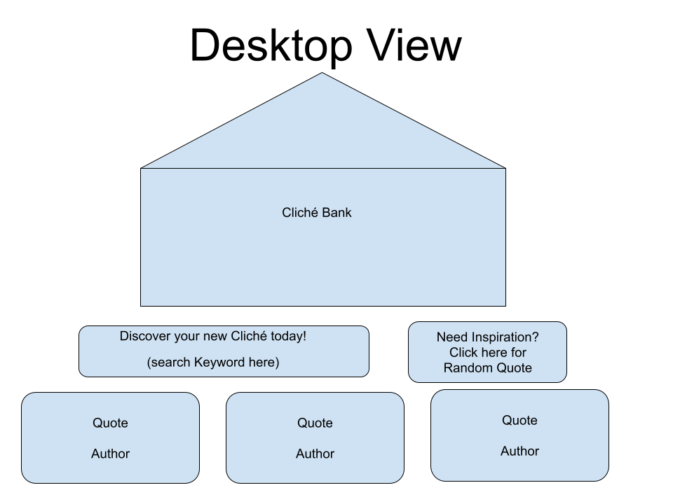
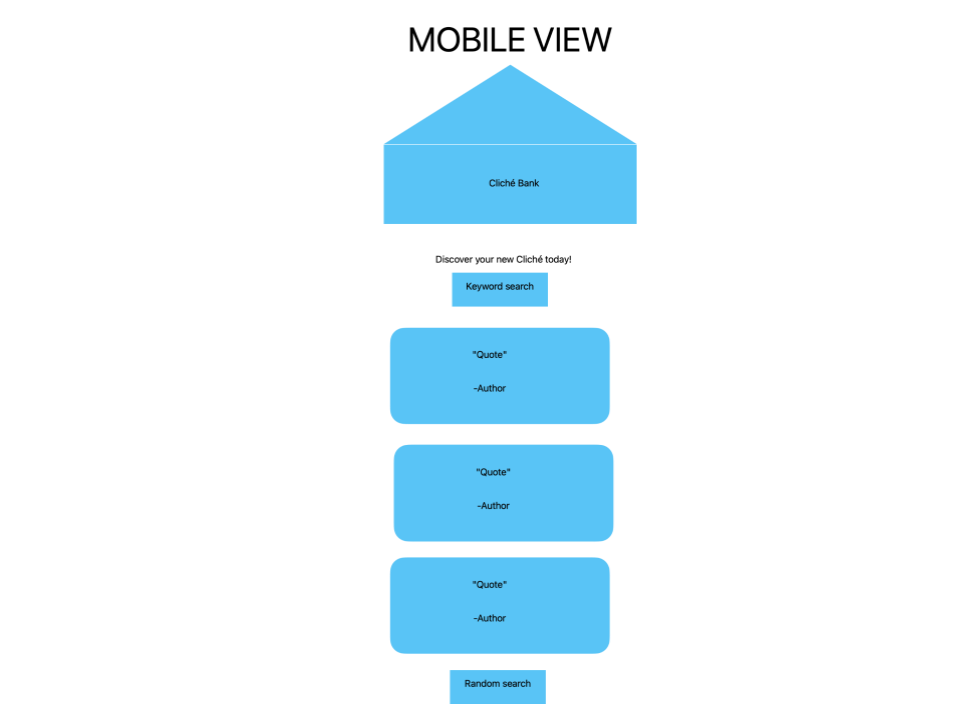

# Cliché Bank
### By Rohan Sinha

DEPLOYED SITE: `https://seal-project-1.vercel.app/`

## Description of Project

> I love a quote that has become engrained into my existence and personality. I learning new clichés the moment a new one arises. I want people to be able to come to Cliché Bank and leave with some clarity on a quote or a new quote to use later. I am using the [Quotable API](https://github.com/lukePeavey/quotable). I want people to come in and do one of the following. Search for a quote on the subject they want or get a new random quote to fall in love with.

## Details about the API

The api does not require an APIkey to generate data. The api provides the following data that I will be using:

-quote
-author

The specific links I am concerned with for this project are the following:

-`https://api.quotable.io/quotes/random`: This will provide the json array of a random, singular quote for people to stick with
- `https://api.quotable.io/quotes?tags=${quote}`: This returns a json array with every quote that is connected to the search terms.

Sample Feth/Ajax called:

```js

// Random Quote
const randomurl = 'https://api.quotable.io/quotes/random'

fetch(randomurl)
.then((res) => res.json())
.then((data) => console.log(data))


// Searched Quote
const searchedurl = 'https://api.quotable.io/search/quotes?query=life+happiness'

fetch(searchedurl)
.then((res) => res.json())
.then((search) => console.log(search))
```


The Data I get back:

```js
//Random JSON
[
{
"_id": "Bs98LxS5Id",
"author": "Abraham Lincoln",
"content": "You cannot escape the responsibility of tomorrow by evading it today.",
"tags": [
"History"
],
"authorSlug": "abraham-lincoln",
"length": 69,
"dateAdded": "2022-03-12",
"dateModified": "2023-04-14"
}
]

//Searched for Happiness


{
  "__info__": {
    "$search": {
      "queryString": {
        "query": "happiness",
        "defaultPath": "content"
      }
    }
  },
  "count": 20,
  "totalCount": 58,
  "page": 1,
  "totalPages": 3,
  "results": [
    {
      "_id": "wQNfb7IAqrk",
      "content": "There is no way to happiness, happiness is the way.",
      "author": "Thích Nhất Hạnh",
      "tags": [
        "Famous Quotes"
      ],
      "authorId": "N0pHADD097gY",
      "authorSlug": "thich-nhat-hanh",
      "length": 51,
      "dateAdded": "2020-03-07",
      "dateModified": "2023-04-14"
    },
    {
      "_id": "soeD1o2PIWwM",
      "content": "Independence is happiness.",
      "author": "Susan B. Anthony",
      "tags": [
        "Famous Quotes"
      ],
      "authorId": "paR_Y4KUZ1D2",
      "authorSlug": "susan-b-anthony",
      "length": 26,
      "dateAdded": "2019-03-15",
      "dateModified": "2023-04-14"
    },
    {
      "_id": "wNdaJpR3m0lK",
      "content": "Action may not always bring happiness; but there is no happiness without action.",
      "author": "Benjamin Disraeli",
      "tags": [
        "Famous Quotes"
      ],
      "authorId": "xAJjt7yV9kyd",
      "authorSlug": "benjamin-disraeli",
      "length": 80,
      "dateAdded": "2020-12-10",
      "dateModified": "2023-04-14"
    },
    {
      "_id": "7jbd4NKNu_lE",
      "content": "Happiness depends upon ourselves.",
      "author": "Aristotle",
      "tags": [
        "Famous Quotes"
      ],
      "authorId": "Z8j-PYl90GLF",
      "authorSlug": "aristotle",
      "length": 33,
      "dateAdded": "2020-10-14",
      "dateModified": "2023-04-14"
    },
    {
      "_id": "j68Sup53R1Eq",
      "content": "Happiness resides not in possessions, and not in gold, happiness dwells in the soul.",
      "author": "Democritus",
      "tags": [
        "Famous Quotes"
      ],
      "authorId": "henwD-BtViiX",
      "authorSlug": "democritus",
      "length": 84,
      "dateAdded": "2021-05-05",
      "dateModified": "2023-04-14"
    },
    {
      "_id": "smbfaOldHD",
      "author": "The Buddha",
      "content": "A disciplined mind brings happiness.",
      "tags": [
        "Wisdom",
        "Happiness"
      ],
      "authorId": "bKQiIqr83",
      "authorSlug": "the-buddha",
      "length": 36,
      "dateAdded": "2023-03-30",
      "dateModified": "2023-04-14"
    },
    {
      "_id": "5_6lVDMuo9IM",
      "content": "Happiness can exist only in acceptance.",
      "author": "George Orwell",
      "tags": [
        "Famous Quotes"
      ],
      "authorId": "YyZuhLs2-ki6",
      "authorSlug": "george-orwell",
      "length": 39,
      "dateAdded": "2021-01-11",
      "dateModified": "2023-04-14"
    },
    {
      "_id": "S_61PHNDnbZ",
      "content": "Wisdom is the supreme part of happiness.",
      "author": "Sophocles",
      "tags": [
        "Famous Quotes",
        "Wisdom"
      ],
      "authorId": "bBwlN7LI2Jtu",
      "authorSlug": "sophocles",
      "length": 40,
      "dateAdded": "2020-04-02",
      "dateModified": "2023-04-14"
    },
    {
      "_id": "z8jAHYsHEhL",
      "content": "Happiness is found in doing, not merely possessing.",
      "author": "Napoleon Hill",
      "tags": [
        "Famous Quotes"
      ],
      "authorId": "N4h708MyElyG",
      "authorSlug": "napoleon-hill",
      "length": 51,
      "dateAdded": "2019-09-23",
      "dateModified": "2023-04-14"
    },
    {
      "_id": "rypL5kmdIg8",
      "content": "A really great talent finds its happiness in execution.",
      "author": "Johann Wolfgang von Goethe",
      "tags": [
        "Famous Quotes",
        "Happiness"
      ],
      "authorId": "aW1ZR-8LuS28",
      "authorSlug": "johann-wolfgang-von-goethe",
      "length": 55,
      "dateAdded": "2020-07-10",
      "dateModified": "2023-04-14"
    },
    {
      "_id": "qu3J1kIMDXfe",
      "content": "Happiness cannot be travelled to, owned, earned, worn or consumed. Happiness is the spiritual experience of living every minute with love, grace and gratitude.",
      "author": "Denis Waitley",
      "tags": [
        "Famous Quotes"
      ],
      "authorId": "Ge0tkRMVUicu",
      "authorSlug": "denis-waitley",
      "length": 159,
      "dateAdded": "2019-07-23",
      "dateModified": "2023-04-14"
    },
    {
      "_id": "_XB2MKPzW7dA",
      "content": "Success is not the key to happiness. Happiness is the key to success. If you love what you are doing, you will be successful.",
      "author": "Albert Schweitzer",
      "tags": [
        "Famous Quotes",
        "Success",
        "Happiness"
      ],
      "authorId": "ANT0MUtjmG6O",
      "authorSlug": "albert-schweitzer",
      "length": 125,
      "dateAdded": "2021-05-12",
      "dateModified": "2023-04-14"
    },
    {
      "_id": "avaEg8R5-LP4",
      "content": "Love is the master key that opens the gates of happiness.",
      "author": "Oliver Wendell Holmes Jr.",
      "tags": [
        "Famous Quotes"
      ],
      "authorId": "qa_R4Oc97JXq",
      "authorSlug": "oliver-wendell-holmes-jr",
      "length": 57,
      "dateAdded": "2019-07-23",
      "dateModified": "2023-04-14"
    },
    {
      "_id": "ueyq9zjTg9Rb",
      "content": "Every gift from a friend is a wish for your happiness.",
      "author": "Richard Bach",
      "tags": [
        "Famous Quotes"
      ],
      "authorId": "t9lNqDH0TmYo",
      "authorSlug": "richard-bach",
      "length": 54,
      "dateAdded": "2019-12-14",
      "dateModified": "2023-04-14"
    },
    {
      "_id": "zJCNH3Q5shhD",
      "content": "Friends show their love in times of trouble, not in happiness.",
      "author": "Euripides",
      "tags": [
        "Famous Quotes",
        "Friendship"
      ],
      "authorId": "yVMYpy-GWWFq",
      "authorSlug": "euripides",
      "length": 62,
      "dateAdded": "2021-03-26",
      "dateModified": "2023-04-14"
    },
    {
      "_id": "0lnHVeiNr0un",
      "content": "They must often change, who would be constant in happiness or wisdom.",
      "author": "Confucius",
      "tags": [
        "Famous Quotes",
        "Wisdom"
      ],
      "authorId": "ropvZKOXYhLr",
      "authorSlug": "confucius",
      "length": 69,
      "dateAdded": "2019-02-13",
      "dateModified": "2023-04-14"
    },
    {
      "_id": "5V7Gw25dIjvc",
      "content": "Happiness is not something ready-made. It comes from your own actions.",
      "author": "Dalai Lama",
      "tags": [
        "Famous Quotes"
      ],
      "authorId": "OPVjtVVBVW5h",
      "authorSlug": "dalai-lama",
      "length": 70,
      "dateAdded": "2019-08-03",
      "dateModified": "2023-04-14"
    },
    {
      "_id": "NZx4vMwOCDxJ",
      "content": "There is only one happiness in life, to love and be loved.",
      "author": "George Sand",
      "tags": [
        "Famous Quotes"
      ],
      "authorId": "9XleFuFL2nyc",
      "authorSlug": "george-sand",
      "length": 58,
      "dateAdded": "2019-10-18",
      "dateModified": "2023-04-14"
    },
    {
      "_id": "HBLejCmmWoIy",
      "content": "Happiness mainly comes from our own attitude, rather than from external factors.",
      "author": "Dalai Lama",
      "tags": [
        "Famous Quotes"
      ],
      "authorId": "OPVjtVVBVW5h",
      "authorSlug": "dalai-lama",
      "length": 80,
      "dateAdded": "2020-04-14",
      "dateModified": "2023-04-14"
    },
    {
      "_id": "V8reXkHpukCS",
      "content": "Success is getting what you want. Happiness is wanting what you get.",
      "author": "Dale Carnegie",
      "tags": [
        "Happiness"
      ],
      "authorId": "D1RNG5b9TsXN",
      "authorSlug": "dale-carnegie",
      "length": 68,
      "dateAdded": "2021-01-10",
      "dateModified": "2023-04-14"
    }
  ]
}
```

##Mockup

### Desktop


### Mobile


## Schedule of Work

|Day | Goal | What I did accomplish |
|----|------|-----------------------|
| Sat | Create Readme, Deploy, Get Approval | |
| Sun | Get HTML set  ||
| Mon |Build fetch of data in JS file ||
| Tues| Render data from API on screen ||
| Wed | wrap up functionality ||
|Thurs| mobile layout styling ||
| Fri | Desktop layout styling ||
| Sat | Present Project ||
